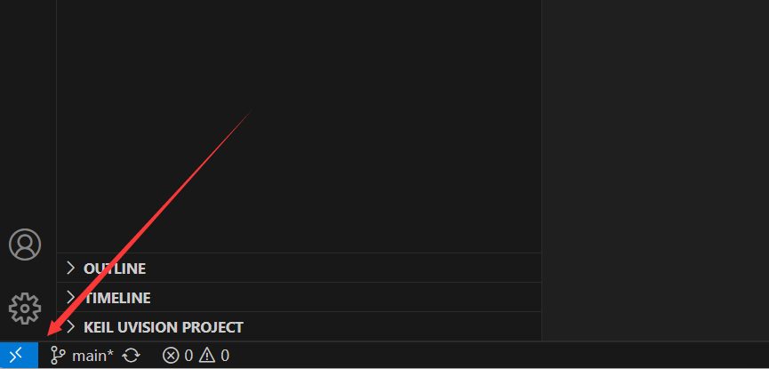
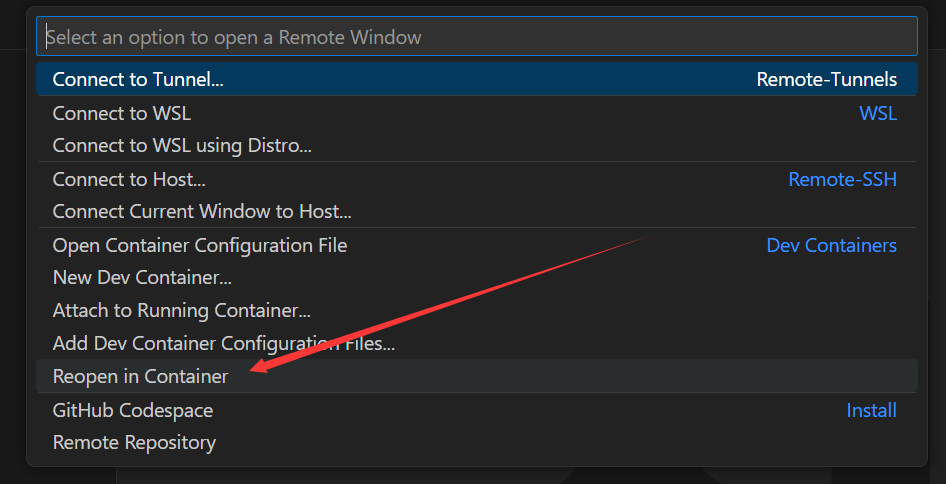
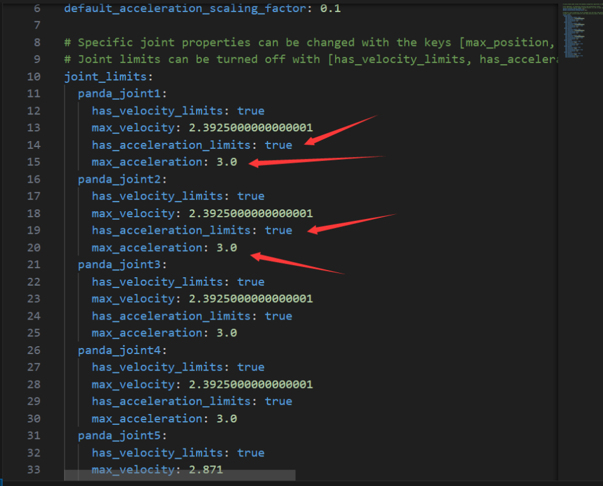
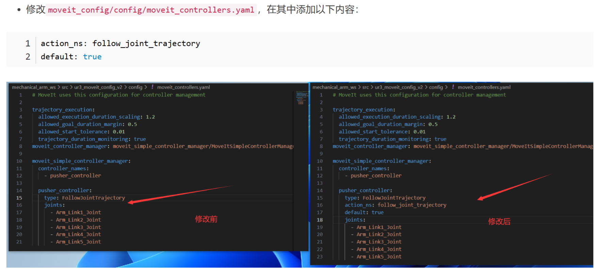
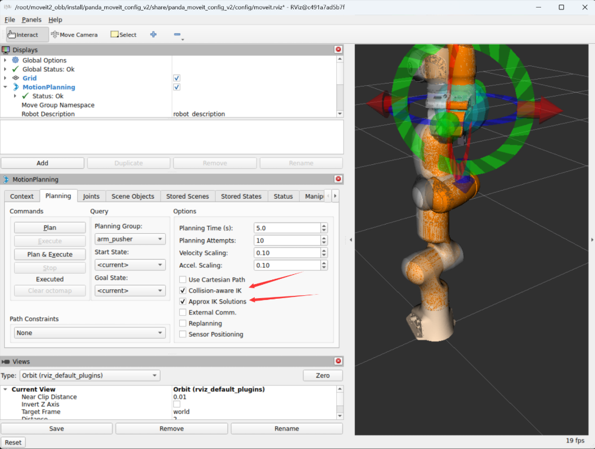

---

# 前言

配置开发环境

> - Ubuntu:24.04
> - ros2:jazzy

# 创建基础环境

1、创建容器





2、启动Mobaxterm软件


# 安装相关的库

```shell
# 按照鱼香ros一键安装完整的ros2:jazzy
sudo apt update
wget http://fishros.com/install -O fishros && bash fishros

# 打开新的终端，安装gz
sudo apt-get update
sudo apt-get install curl lsb-release gnupg -y
sudo curl https://packages.osrfoundation.org/gazebo.gpg --output /usr/share/keyrings/pkgs-osrf-archive-keyring.gpg
echo "deb [arch=$(dpkg --print-architecture) signed-by=/usr/share/keyrings/pkgs-osrf-archive-keyring.gpg] http://packages.osrfoundation.org/gazebo/ubuntu-stable $(lsb_release -cs) main" | sudo tee /etc/apt/sources.list.d/gazebo-stable.list > /dev/null


sudo apt-get update -y
sudo apt-get install gz-harmonic -y

# 安装远程显示服务程序
apt install x11-xserver-utils libxcb* -y

# 安装moveit
apt install ros-${ROS_DISTRO}-moveit* -y

# sudo apt-get update 
# sudo apt-get install -y ros-${ROS_DISTRO}-rmw-cyclonedds-cpp 
# export RMW_IMPLEMENTATION=rmw_cyclonedds_cpp
# export LIBGL_ALWAYS_SOFTWARE=1
# export GZ_SIM_SYSTEM_PLUGIN_PATH=/opt/ros/${ROS_DISTRO}/lib/
# # sudo apt install ros-${ROS_DISTRO}-gazebo-ros-pkgs ros-${ROS_DISTRO}-gazebo-ros2-control -y

# 安装ros2的控制功能包
sudo apt install ros-${ROS_DISTRO}-controller-manager -y
sudo apt install ros-${ROS_DISTRO}-joint-trajectory-controller -y
sudo apt install ros-${ROS_DISTRO}-joint-state-broadcaster -y
sudo apt install ros-${ROS_DISTRO}-diff-drive-controller -y

# 安装其他功能包
apt install ros-${ROS_DISTRO}-ros-gz -y
apt-get install ros-${ROS_DISTRO}-joint-state-publisher-gui -y
apt install ros-${ROS_DISTRO}-moveit-ros-planning-interface -y
# apt install ros-jazzy-gz-ros2-control 这个很重要 https://github.com/ros-controls/gz_ros2_control
apt install ros-${ROS_DISTRO}-gz-ros2-control -y

# 用于调试，可不安装
apt-get install gdb -y

# 安装python第三方库
# apt install python3-pip -y
# pip config set global.index-url https://pypi.tuna.tsinghua.edu.cn/simple
# pip install pyside6 xacro --break-system-packages
# # pip install pyside6 xacro ultralytics NodeGraphQt --break-system-packages
# pip install -U colcon-common-extensions vcstool --break-system-packages
pip install -r requirements.txt --break-system-packages
apt install python3-vcstool
sudo apt-get install dos2unix
```


# 运行测试

```shell
# Shell A
source install/setup.bash
ros2 launch panda_moveit_config gazebo_obb.launch.py

# Shell B 调试用，在vscode中要安装ROS（Microsoft）、Python等模块，还要在Python文件中选择Python编译器
# source install/setup.bash
# ros2 launch panda_moveit_config arm_control.launch.py

# Shell C
source install/setup.bash
ros2 launch yolov8_obb yolov8_obb.launch.py

# Shell D
source install/setup.bash
cd src/ui_controller/
python3 main.py
```

# 报错

❌

```shell
[move_group-3] [ERROR] [1742286584.537923487] [move_group.moveit.moveit.core.time_optimal_trajectory_generation]: No acceleration limit was defined for joint panda_joint1! You have to define acceleration limits in the URDF or joint_limits.yaml
```

✔️

设置好加速度




❌

```shell
[move_group-3] [ERROR] [1742286725.635634628] [move_group.moveit.moveit.ros.trajectory_execution_manager]: Unable to identify any set of controllers that can actuate the specified joints: [ panda_joint1 panda_joint2 panda_joint3 panda_joint4 panda_joint5 panda_joint6 panda_joint7 ]
[move_group-3] [ERROR] [1742286725.635688171] [move_group.moveit.moveit.ros.trajectory_execution_manager]: Known controllers and their joints:
[move_group-3] 
[move_group-3] [ERROR] [1742286725.635703240] [move_group.moveit.moveit.ros.plan_execution]: Apparently trajectory initialization failed
[move_group-3] [INFO] [1742286725.635767383] [move_group.moveit.moveit.ros.move_group.move_action]: CONTROL_FAILED
[rviz2-4] [INFO] [1742286725.636182552] [moveit_2565687607.moveit.ros.move_group_interface]: Plan and Execute request aborted
[rviz2-4] [ERROR] [1742286725.637270976] [moveit_2565687607.moveit.ros.move_group_interface]: MoveGroupInterface::move() failed or timeout reached
```

✔️



```shell
action_ns: follow_joint_trajectory
default: true
```

❌：执行夹取的过程中，夹爪打开和关闭异常

```shell
[ERROR] [1742603349.012384448] [moveit_3836862178.moveit.ros.check_start_state_bounds]: Joint 'panda_finger_joint1' from the starting state is outside bounds by: [-6.61565e-14 ] should be in the range [0 ], [0.04 ].
[ERROR] [1742603349.012503158] [moveit_py]: PlanningRequestAdapter 'CheckStartStateBounds' failed, because 'Start state out of bounds.'. Aborting planning pipeline.
[ERROR] [1742603349.013678982] [moveit_py.pose_goal]: Planning failed
```

🤔：范围超了，导致`CheckStartStateBounds`不通过

✔️：调试一下初始位置

moveit调试



❌
```shell
[yolov8_obb_publisher.py-1] /usr/bin/env: 'python3\r': No such file or directory
[yolov8_obb_publisher.py-1] /usr/bin/env: use -[v]S to pass options in shebang lines
```

✔️
```shell
find ros2_project/src -type f -name "*.py" -print0 | xargs -0 dos2unix
```