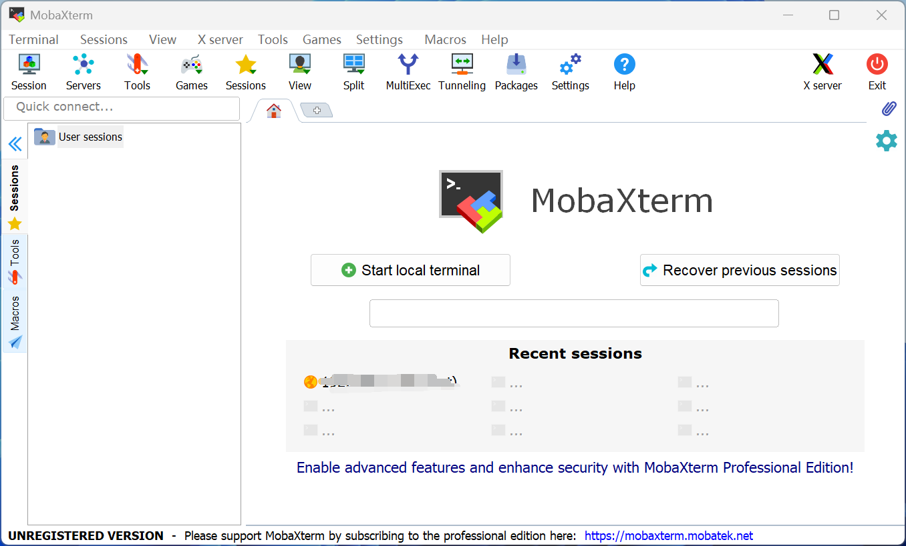

---

# 前言

配置开发环境

> - Ubuntu:24.04
> - ros2:jazzy

# 创建基础环境

1、创建容器


2、启动Mobaxterm软件



# 安装相关的库
```shell
# 按照鱼香ros一键安装完整的ros2:jazzy
sudo apt update
wget http://fishros.com/install -O fishros && bash fishros

# 打开新的终端，安装gz
sudo apt-get update
sudo apt-get install curl lsb-release gnupg -y
sudo curl https://packages.osrfoundation.org/gazebo.gpg --output /usr/share/keyrings/pkgs-osrf-archive-keyring.gpg
echo "deb [arch=$(dpkg --print-architecture) signed-by=/usr/share/keyrings/pkgs-osrf-archive-keyring.gpg] http://packages.osrfoundation.org/gazebo/ubuntu-stable $(lsb_release -cs) main" | sudo tee /etc/apt/sources.list.d/gazebo-stable.list > /dev/null

sudo apt-get update -y
sudo apt-get install gz-harmonic -y

# 安装远程显示服务程序
apt install x11-xserver-utils libxcb* -y

# 安装moveit
apt install ros-${ROS_DISTRO}-moveit* -y

# 安装ros2的控制功能包
sudo apt install ros-${ROS_DISTRO}-controller-manager -y
sudo apt install ros-${ROS_DISTRO}-joint-trajectory-controller -y
sudo apt install ros-${ROS_DISTRO}-joint-state-broadcaster -y
sudo apt install ros-${ROS_DISTRO}-diff-drive-controller -y

# 安装其他功能包
apt install ros-${ROS_DISTRO}-ros-gz -y
apt-get install ros-${ROS_DISTRO}-joint-state-publisher-gui -y
apt install ros-${ROS_DISTRO}-moveit-ros-planning-interface -y
# apt install ros-jazzy-gz-ros2-control 这个很重要 https://github.com/ros-controls/gz_ros2_control
apt install ros-${ROS_DISTRO}-gz-ros2-control -y

# 用于调试，可不安装
apt-get install gdb -y

# 安装python第三方库
# apt install python3-pip -y
# pip config set global.index-url https://pypi.tuna.tsinghua.edu.cn/simple
# pip install pyside6 xacro --break-system-packages
# # pip install pyside6 xacro ultralytics NodeGraphQt --break-system-packages
# pip install -U colcon-common-extensions vcstool --break-system-packages
# pip install -r requirements.txt --break-system-packages
# apt install python3-vcstool
# sudo apt-get install dos2unix

cd GraphExecuter/graph_executer
pip install -r requirements_lmoveit2_yolobb_ws.txt --no-dependencies --break-system-packages

cd downloads
git clone https://github.com/laoxue888/NodeGraphQt.git
cd downloads/NodeGraphQt
pip install -e . --break-system-packages
```
