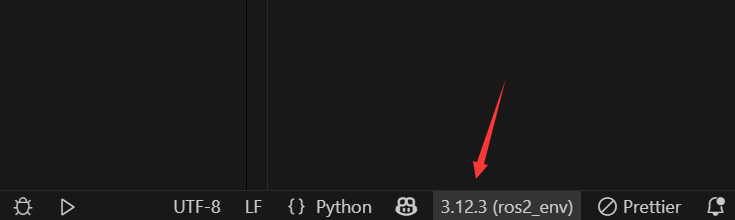
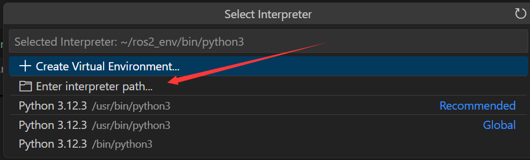
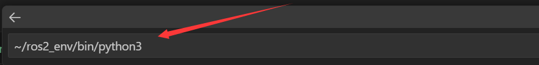

  
---

# 前言

# 配置开发环境

❇️创建虚拟环境

```shell
# unminimize

python3 -m venv ~/ros2_env 
echo "source ~/ros2_env/bin/activate" > ~/.bashrc
source ~/.bashrc
```

❇️安装ros2

```shell
pip install pyyaml distro-info distro

# 按照鱼香ros一键安装完整的ros2:jazzy
sudo apt update
wget http://fishros.com/install -O fishros && bash fishros

# 打开新的终端，安装gz
sudo apt-get update
sudo apt-get install curl lsb-release gnupg -y
sudo curl https://packages.osrfoundation.org/gazebo.gpg --output /usr/share/keyrings/pkgs-osrf-archive-keyring.gpg
echo "deb [arch=$(dpkg --print-architecture) signed-by=/usr/share/keyrings/pkgs-osrf-archive-keyring.gpg] http://packages.osrfoundation.org/gazebo/ubuntu-stable $(lsb_release -cs) main" | sudo tee /etc/apt/sources.list.d/gazebo-stable.list > /dev/null

sudo apt-get update -y
sudo apt-get install gz-harmonic -y

# sudo apt-get install ros-${ROS_DISTRO}-gazebo-ros-pkgs -y
# sudo apt install ros-${ROS_DISTRO}-gazebo-ros-pkgs 

# 安装远程显示服务程序
apt install x11-xserver-utils libxcb* -y

# 安装moveit
apt install ros-${ROS_DISTRO}-moveit* -y

# 安装ros2的控制功能包
sudo apt install ros-${ROS_DISTRO}-controller-manager -y
sudo apt install ros-${ROS_DISTRO}-joint-trajectory-controller -y
sudo apt install ros-${ROS_DISTRO}-joint-state-broadcaster -y
sudo apt install ros-${ROS_DISTRO}-diff-drive-controller -y

# 安装其他功能包
apt install ros-${ROS_DISTRO}-ros-gz -y #ros_gz
apt-get install ros-${ROS_DISTRO}-joint-state-publisher-gui -y
apt install ros-${ROS_DISTRO}-moveit-ros-planning-interface -y
# apt install ros-jazzy-gz-ros2-control 这个很重要 https://github.com/ros-controls/gz_ros2_control
apt install ros-${ROS_DISTRO}-gz-ros2-control* -y

# 用于调试，可不安装
apt-get install gdb -y

# 安装python第三方库
# apt install python3-pip -y
# pip config set global.index-url https://pypi.tuna.tsinghua.edu.cn/simple
# pip install pyside6 xacro --break-system-packages
# # pip install pyside6 xacro ultralytics NodeGraphQt --break-system-packages
# pip install -U colcon-common-extensions vcstool --break-system-packages
# pip install -r requirements.txt --break-system-packages
# apt install python3-vcstool
# sudo apt-get install dos2unix

cd GraphExecuter/graph_executer
pip install -r requirements_moveit2_yolobb_ws.txt

cd downloads
git clone https://github.com/laoxue888/NodeGraphQt.git
cd downloads/NodeGraphQt
pip install -e . 

# pip install ipyparallel
```

❇️添加终端启动sh

```shell
echo "source /opt/ros/jazzy/setup.bash" > ~/.bashrc
source ~/.bashrc
```

❇️安装必要的第三方库

```shell
pip install empy catkin_pkg lark jinja2 typeguard
sudo apt install python3-colcon-common-extensions -y
```

❇️设置Python文件运行路径







```bash
~/ros2_env/bin/python3
```

❇️配置jupyter-notebook环境

```shell
pip install jupyter jupyter-contrib-nbextensions notebook bqplot pyyaml ipywidgets jupyros

echo "export PATH=~/.local/bin:${PATH}" > ~/.bashrc
source ~/.bashrc

# 取消代理（Failed to connect to 127.0.0.1 port 1008）
git config --global --unset http.proxy
git config --global --unset https.proxy

# 使用代理
git config --global http.proxy "http://127.0.0.1:7890"
git config --global https.proxy "http://127.0.0.1:7890"
```

<!-- ❇️创建软链接

```shell
# ln  -s   [源文件]   [软链接文件]
mkdir /usr/bin/ros2_env
# touch /usr/bin/ros2_env/python3
# chmod +x /usr/bin/ros2_env/python3
ln -s ~/ros2_env/bin/python3 /usr/bin/ros2_env/python3
``` -->

<!-- ❇️配置jupyter-ros2的环境

```shell
pip install jupyter jupyter-contrib-nbextensions notebook bqplot pyyaml ipywidgets

# echo "export PATH=~/.local/bin:${PATH}" > ~/.bashrc
# source ~/.bashrc

# pip install jupyter_nbextensions_configurator
# pip install jupyter_contrib_nbextensions

# jupyter nbextensions_configurator enable --user

# jupyter nbextension enable --py --sys-prefix ipywidgets

sudo apt install -y nodejs npm

npm -v
nodejs -v

pip install nodejs npm

pip install jupyter-ros2
``` -->