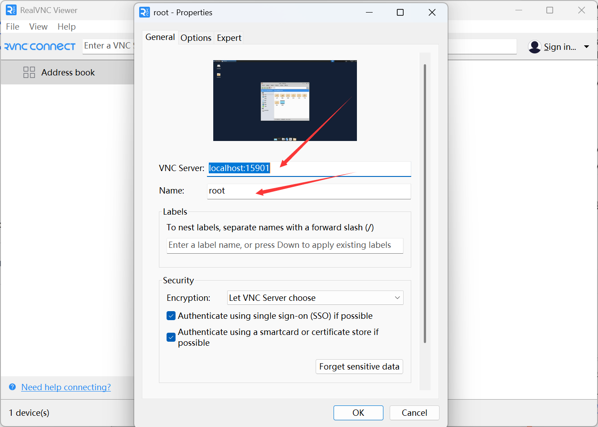
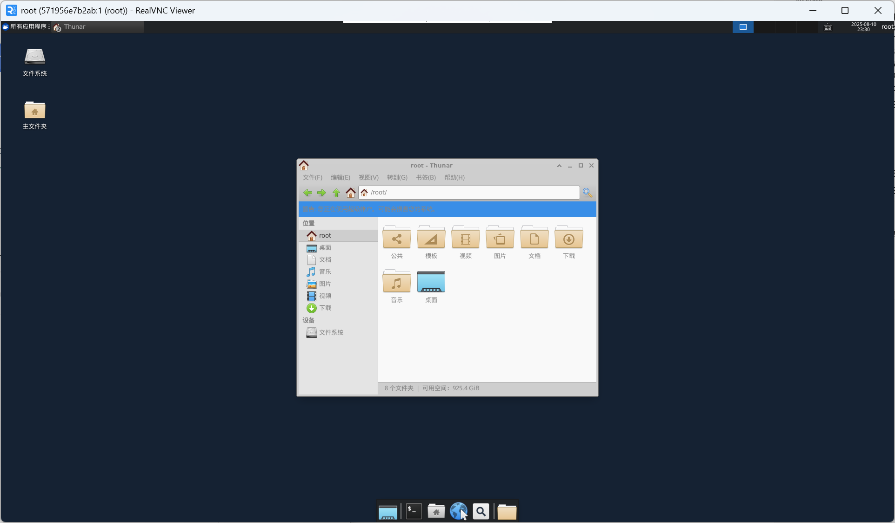
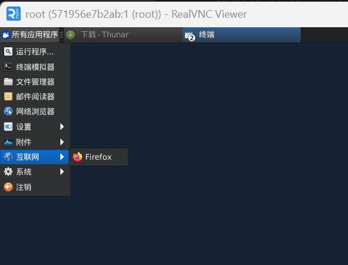
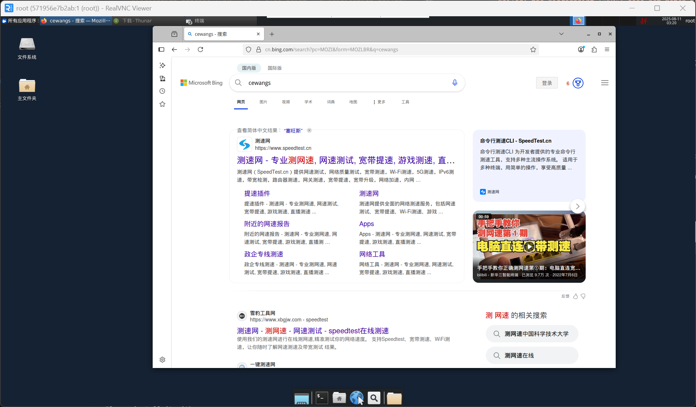

---

# 前言

安装Docker容器远程桌面

# 操作

```shell
# 进入Docker容器
unminimize

echo $LANG


locale -a

apt install language-pack-zh-hans vim -y

vim /etc/profile

LANG="zh_CN.UTF-8"
LANGUAGE="zh_CN:zh:en_US:en"


vim ~/.bashrc

LANG="zh_CN.UTF-8"
LANGUAGE="zh_CN:zh:en_US:en"


sudo locale-gen

source ~/.bashrc

apt install tigervnc-standalone-server -y


#精简安装
sudo apt-get install -y --no-install-recommends xubuntu-desktop 
#不安装这个会报错Failed to execute child process “dbus-lauch”(xxxxx)
apt install dbus-x11 -y
#安装中文字体 ,否则会出现乱码
apt install fonts-wqy-microhei -y
#安装中文语言名和fcitx中文输入法
apt install -y gnome-user-docs-zh-hans language-pack-gnome-zh-hans fcitx fcitx-pinyin fcitx-table-wubi


#设置vnc连接密码，有一个要选n
vncpasswd

vim ~/.vnc/xstartup

#!/bin/sh
unset SESSION_MANAGER
unset DBUS_SESSION_BUS_ADDRESS
export GTK_IM_MODULE=fcitx
export QT_IM_MODULE=fcitx
export XMODIFIERS=@im=fcitx
export LANG=zh_CN.UTF-8
fcitx -r
startxfce4

chmod u+x ~/.vnc/xstartup

# 启动vncserver
vncserver :1 -localhost no -geometry=1920x1080
```

❤️效果





# 安装软件

## [火狐软件安装](https://support.mozilla.org/zh-CN/kb/install-firefox-linux?redirectslug=linux-firefox&redirectlocale=zh-CN)

```shell
# 创建一个保存 APT 库密钥的目录：
sudo install -d -m 0755 /etc/apt/keyrings

# 导入 Mozilla APT 密钥环：
wget -q https://packages.mozilla.org/apt/repo-signing-key.gpg -O- | sudo tee /etc/apt/keyrings/packages.mozilla.org.asc > /dev/null

# 密钥指纹应该是 35BAA0B33E9EB396F59CA838C0BA5CE6DC6315A3。你可以用以下命令检查：
gpg -n -q --import --import-options import-show /etc/apt/keyrings/packages.mozilla.org.asc | awk '/pub/{getline; gsub(/^ +| +$/,""); if($0 == "35BAA0B33E9EB396F59CA838C0BA5CE6DC6315A3") print "\nThe key fingerprint matches ("$0").\n"; else print "\nVerification failed: the fingerprint ("$0") does not match the expected one.\n"}'

#把 Mozilla APT 库添加到源列表中：
echo "deb [signed-by=/etc/apt/keyrings/packages.mozilla.org.asc] https://packages.mozilla.org/apt mozilla main" | sudo tee -a /etc/apt/sources.list.d/mozilla.list > /dev/null

# 配置 APT 优先使用 Mozilla 库中的包：
echo '
Package: *
Pin: origin packages.mozilla.org
Pin-Priority: 1000
' | sudo tee /etc/apt/preferences.d/mozilla

#更新软件列表并安装 firefox（或 firefox-esr、-beta、-nightly、-devedition 之一）：
sudo apt-get update && sudo apt-get install firefox
```

❤️效果






# 参考

- [04docker容器中安装中文vnc图形界面](https://www.bilibili.com/video/BV1mL41177Av/?spm_id_from=333.337.search-card.all.click&vd_source=3bf4271e80f39cfee030114782480463)
- [docker容器安装图形桌面](https://blog.csdn.net/lxyoucan/article/details/121679346)