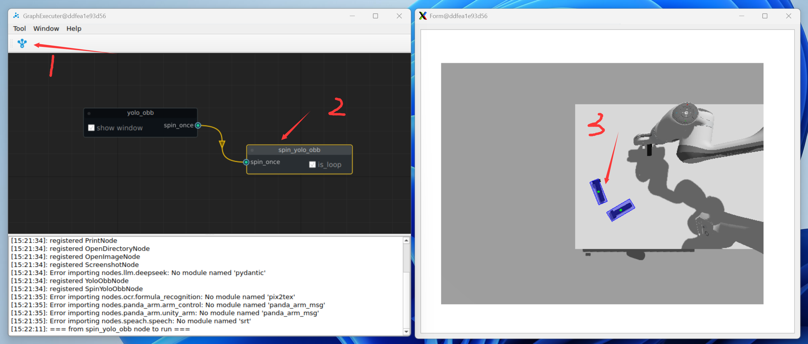
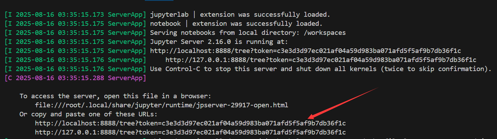
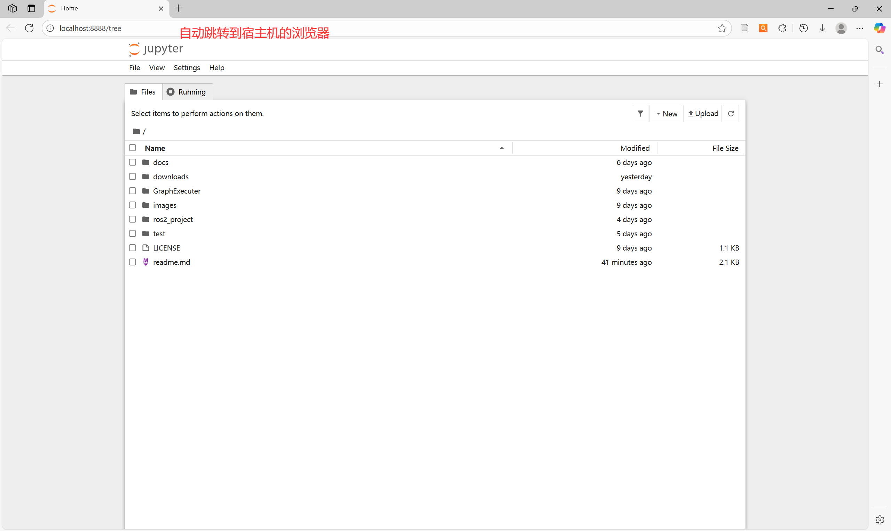

---

# 前言

运行测试

# 测试

1、编译ros2项目

```shell
cd ros2_project
colcon build
```

2、启动MobaXterm

3、打开仿真环境

```shell
# ShellA
cd ros2_project 
source install/setup.bash
ros2 launch panda_moveit_config gazebo.launch.py
```

4、运行GraphExecuter
```shell
# ShellB
cd GraphExecuter/graph_executer
source /workspaces/ros2_project/install/setup.bash
python3 main.py
```


5、打开控制服务
```shell
# ShellC
cd ros2_project 
source install/setup.bash
ros2 launch yolov8_obb yolov8_obb.launch.py
```

6、选中要抓起的物体



# 其他

## 终端启动jupyter-notebook

```shell
jupyter-notebook --allow-root
```






## 可能要安装以下第三方库

```shell
# conda activate graph_executer
pip3 install catkin_pkg
pip install empy
pip install lark
pip install colcon-common-extensions
```