ros2 launch panda_moveit_config_v2 demo.launch.py

# 前言

本文介绍使用rviz2 moveit2控制gazebo中的仿真模型。

# ros2与gazebo harmonic联合仿真案例

## ros2_control原理

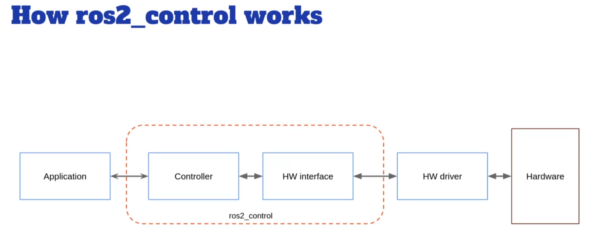

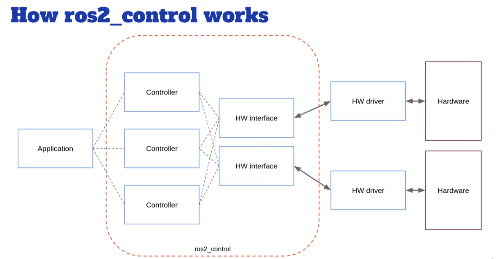

## `moveit_setup_assistant`生成配置

❇️先编译一下
```shell
colcon build
```

❇️运行`moveit_setup_assistant`
```shell
source install/setup.bash
ros2 run moveit_setup_assistant moveit_setup_assistant
```

❇️以下是一些关键的步骤截图

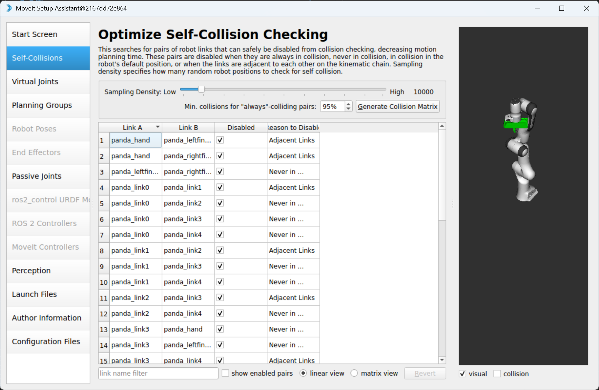

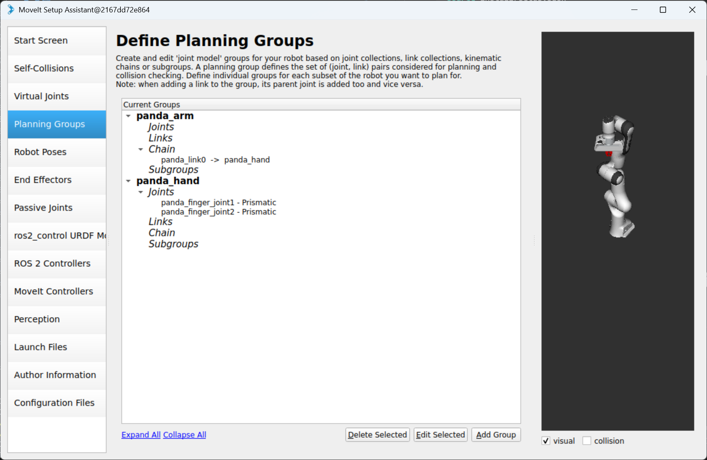

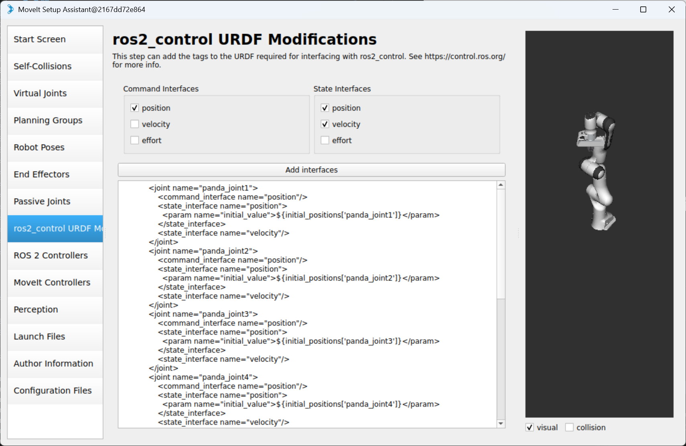

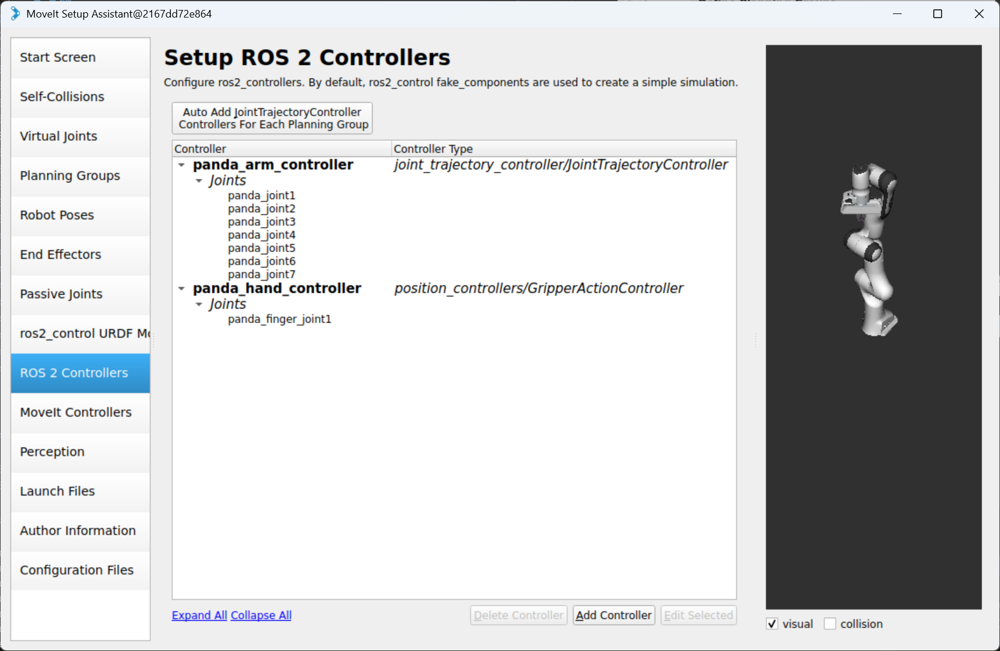

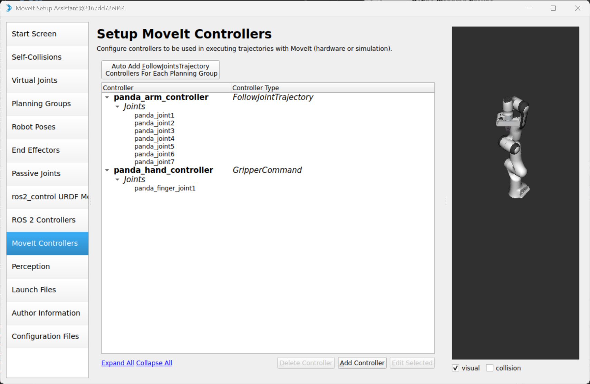

## 修改`moveit_setup_assistant`生成的配置

❇️修改初始位置`initial_positions.yaml`

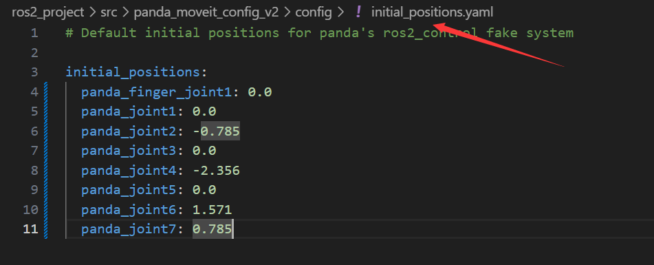

❇️修改joint的限制`joint_limits.yaml`

```yaml
# joint_limits.yaml allows the dynamics properties specified in the URDF to be overwritten or augmented as needed

# For beginners, we downscale velocity and acceleration limits.
# You can always specify higher scaling factors (<= 1.0) in your motion requests.  # Increase the values below to 1.0 to always move at maximum speed.
default_velocity_scaling_factor: 0.1
default_acceleration_scaling_factor: 0.1

# Specific joint properties can be changed with the keys [max_position, min_position, max_velocity, max_acceleration]
# Joint limits can be turned off with [has_velocity_limits, has_acceleration_limits]
joint_limits:
  panda_finger_joint1:
    has_velocity_limits: true
    max_velocity: 100.0
    has_acceleration_limits: true
    max_acceleration: 3.0
  panda_finger_joint2:
    has_velocity_limits: true
    max_velocity: 100.0
    has_acceleration_limits: true
    max_acceleration: 3.0
  panda_joint1:
    has_velocity_limits: true
    max_velocity: 2.3925000000000001
    has_acceleration_limits: true
    max_acceleration: 3.0
  panda_joint2:
    has_velocity_limits: true
    max_velocity: 2.3925000000000001
    has_acceleration_limits: true
    max_acceleration: 3.0
  panda_joint3:
    has_velocity_limits: true
    max_velocity: 2.3925000000000001
    has_acceleration_limits: true
    max_acceleration: 3.0
  panda_joint4:
    has_velocity_limits: true
    max_velocity: 2.3925000000000001
    has_acceleration_limits: true
    max_acceleration: 3.0
  panda_joint5:
    has_velocity_limits: true
    max_velocity: 2.871
    has_acceleration_limits: true
    max_acceleration: 3.0
  panda_joint6:
    has_velocity_limits: true
    max_velocity: 2.871
    has_acceleration_limits: true
    max_acceleration: 3.0
  panda_joint7:
    has_velocity_limits: true
    max_velocity: 2.871
    has_acceleration_limits: true
    max_acceleration: 3.0
```

❇️修改控制配置`moveit_controllers.yaml`

```yaml
# MoveIt uses this configuration for controller management

moveit_controller_manager: moveit_simple_controller_manager/MoveItSimpleControllerManager

moveit_simple_controller_manager:
  controller_names:
    - panda_arm_controller
    - panda_hand_controller

  panda_arm_controller:
    type: FollowJointTrajectory
    action_ns: follow_joint_trajectory
    default: true
    joints:
      - panda_joint1
      - panda_joint2
      - panda_joint3
      - panda_joint4
      - panda_joint5
      - panda_joint6
      - panda_joint7
  panda_hand_controller:
    type: GripperCommand
    joints:
      - panda_finger_joint1
    action_ns: gripper_cmd
    default: true
```

❇️修改`ros2_controllers.yaml`
```yaml
# This config file is used by ros2_control
controller_manager:
  ros__parameters:
    update_rate: 100  # Hz

    panda_arm_controller:
      type: joint_trajectory_controller/JointTrajectoryController


    panda_hand_controller:
      type: position_controllers/GripperActionController


    joint_state_broadcaster:
      type: joint_state_broadcaster/JointStateBroadcaster

panda_arm_controller:
  ros__parameters:
    action_ns: follow_joint_trajectory
    default: true
    joints:
      - panda_joint1
      - panda_joint2
      - panda_joint3
      - panda_joint4
      - panda_joint5
      - panda_joint6
      - panda_joint7
    command_interfaces:
      - position
    state_interfaces:
      - position
      - velocity
    allow_nonzero_velocity_at_trajectory_end: true
panda_hand_controller:
  ros__parameters:
    joint: panda_finger_joint1
```

## 测试运行

```shell
cd ros2_project
source install/setup.bash
ros2 launch panda_moveit_config_v2 demo.launch.py
```

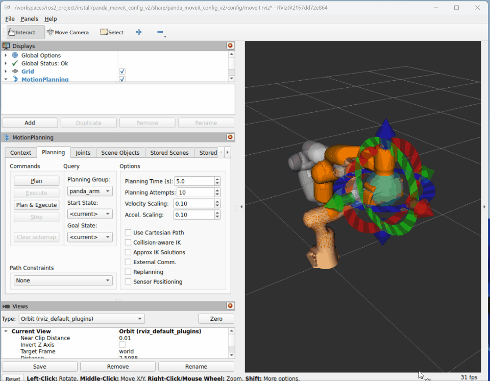

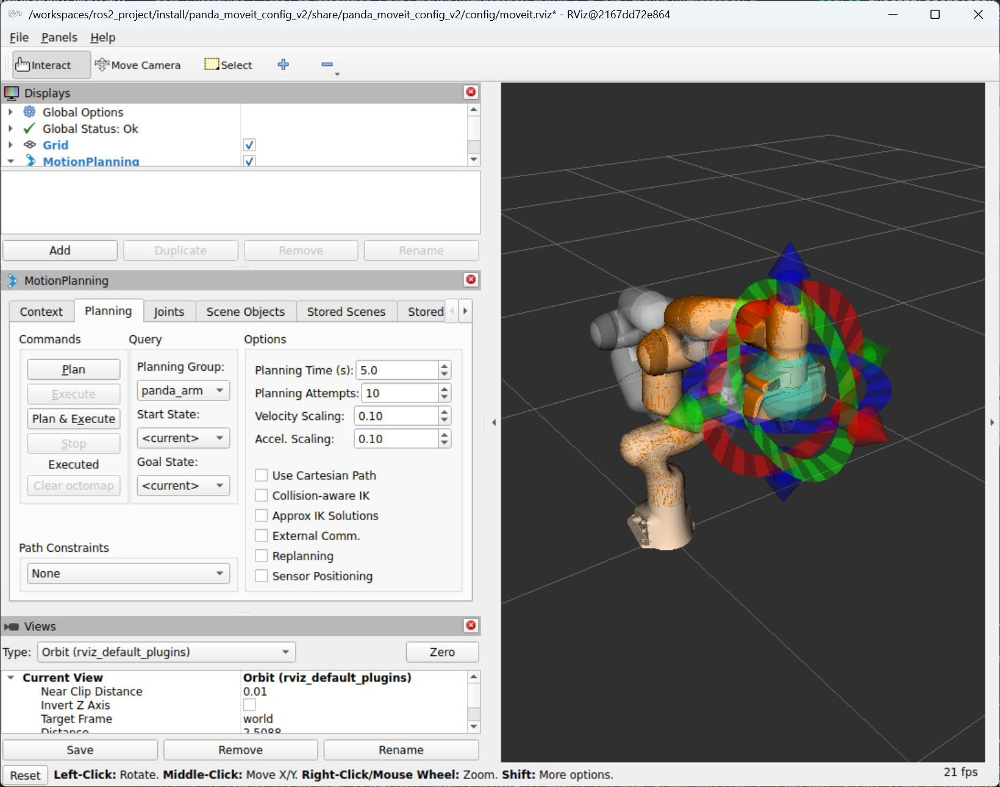


## 编写`panda.gazebo.ros2_control.xacro`文件

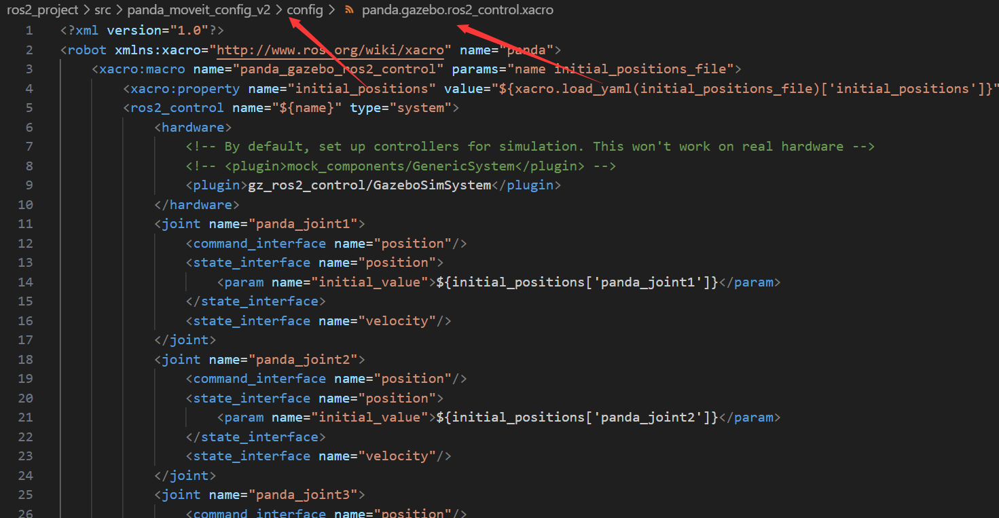

```xml
<?xml version="1.0"?>
<robot xmlns:xacro="http://www.ros.org/wiki/xacro" name="panda">
    <xacro:macro name="panda_gazebo_ros2_control" params="name initial_positions_file">
        <xacro:property name="initial_positions" value="${xacro.load_yaml(initial_positions_file)['initial_positions']}"/>
        <ros2_control name="${name}" type="system">
            <hardware>
                <!-- By default, set up controllers for simulation. This won't work on real hardware -->
                <!-- <plugin>mock_components/GenericSystem</plugin> -->
                <plugin>gz_ros2_control/GazeboSimSystem</plugin>
            </hardware>
            <joint name="panda_joint1">
                <command_interface name="position"/>
                <state_interface name="position">
                    <param name="initial_value">${initial_positions['panda_joint1']}</param>
                </state_interface>
                <state_interface name="velocity"/>
            </joint>
            <joint name="panda_joint2">
                <command_interface name="position"/>
                <state_interface name="position">
                    <param name="initial_value">${initial_positions['panda_joint2']}</param>
                </state_interface>
                <state_interface name="velocity"/>
            </joint>
            <joint name="panda_joint3">
                <command_interface name="position"/>
                <state_interface name="position">
                    <param name="initial_value">${initial_positions['panda_joint3']}</param>
                </state_interface>
                <state_interface name="velocity"/>
            </joint>
            <joint name="panda_joint4">
                <command_interface name="position"/>
                <state_interface name="position">
                    <param name="initial_value">${initial_positions['panda_joint4']}</param>
                </state_interface>
                <state_interface name="velocity"/>
            </joint>
            <joint name="panda_joint5">
                <command_interface name="position"/>
                <state_interface name="position">
                    <param name="initial_value">${initial_positions['panda_joint5']}</param>
                </state_interface>
                <state_interface name="velocity"/>
            </joint>
            <joint name="panda_joint6">
                <command_interface name="position"/>
                <state_interface name="position">
                    <param name="initial_value">${initial_positions['panda_joint6']}</param>
                </state_interface>
                <state_interface name="velocity"/>
            </joint>
            <joint name="panda_joint7">
                <command_interface name="position"/>
                <state_interface name="position">
                    <param name="initial_value">${initial_positions['panda_joint7']}</param>
                </state_interface>
                <state_interface name="velocity"/>
            </joint>

            <joint name="panda_finger_joint1">
                <command_interface name="position" />
                <state_interface name="position">
                  <param name="initial_value">${initial_positions['panda_finger_joint1']}</param>
                </state_interface>
                <state_interface name="velocity"/>
            </joint>
        </ros2_control>
        
    </xacro:macro>
</robot>
```

## 修改`panda.urdf.xacro`文件

```xml
<?xml version="1.0"?>
<robot xmlns:xacro="http://www.ros.org/wiki/xacro" name="panda">
    <xacro:arg name="initial_positions_file" default="initial_positions.yaml" />
    <!-- Import panda urdf file -->
    <xacro:include filename="$(find robot_description)/urdf/panda.urdf" />
    <!-- Import control_xacro -->
    <!-- <xacro:include filename="panda.ros2_control.xacro" />
    <xacro:panda_ros2_control name="FakeSystem" initial_positions_file="$(arg initial_positions_file)"/> -->
    <!-- <xacro:panda_gazebo_ros2_control name="FakeSystem" initial_positions_file="$(arg initial_positions_file)"/> -->
    <!-- panda_gazebo_ros2_control名称要对应文件中的名称 -->
    <gazebo>
        <plugin
        filename="gz_ros2_control-system"
        name="gz_ros2_control::GazeboSimROS2ControlPlugin">
            <parameters>$(find panda_moveit_config_v2)/config/ros2_controllers.yaml</parameters>
        </plugin>
    </gazebo>

    <xacro:include filename="panda.gazebo.ros2_control.xacro" />

    <xacro:panda_gazebo_ros2_control name="GazeboSimSystem"
        initial_positions_file="$(arg initial_positions_file)"/>
</robot>
```

## 编写`gazebo.launch.py`文件

```py

from moveit_configs_utils import MoveItConfigsBuilder
from ament_index_python.packages import get_package_share_directory
from launch_ros. actions import Node
from launch import LaunchDescription
from launch import LaunchDescription
from launch.actions import IncludeLaunchDescription
from launch.launch_description_sources import PythonLaunchDescriptionSource
from launch.actions import RegisterEventHandler, SetEnvironmentVariable
import os
from launch.actions import DeclareLaunchArgument, ExecuteProcess, IncludeLaunchDescription
from pathlib import Path

def generate_launch_description():
    packagepath = get_package_share_directory('panda_moveit_config_v2')
    print(packagepath)

    # 找到robot_description功能包
    robot_description_path = os.path.join(
        get_package_share_directory('robot_description'))
    
    # 找到panda_moveit_config功能包
    arm_robot_sim_path = os.path.join(
        get_package_share_directory('panda_moveit_config_v2'))
    

    # Set gazebo sim resource path
    gazebo_resource_path = SetEnvironmentVariable(
        name='GZ_SIM_RESOURCE_PATH',
        value=[
            os.path.join(arm_robot_sim_path, 'worlds'), ':' +
            str(Path(robot_description_path).parent.resolve())
            ]
        )
    # Load the robot configuration
    moveit_config =(MoveItConfigsBuilder("panda_arm", package_name="panda_moveit_config_v2")
                .robot_description('config/panda.urdf.xacro')
                .moveit_cpp(arm_robot_sim_path + "/config/controller_setting.yaml")
                .robot_description_semantic('config/panda.srdf').to_moveit_configs()
    )

    #启动Gazebo
    gazebo_node = IncludeLaunchDescription(
        PythonLaunchDescriptionSource([
            get_package_share_directory('ros_gz_sim') + '/launch/gz_sim.launch.py'
        ]),
        launch_arguments=[('gz_args', 'empty.sdf -r --physics-engine gz-physics-bullet-featherstone-plugin')]
    )

    #将机械臂添加到Gazebo
    robot_to_gazebo_node = Node(
        package='ros_gz_sim',
        executable='create',
        arguments=['-string', moveit_config.robot_description["robot_description"], '-x', '0.0', '-y', '0.0', '-z', '0.0', '-name', 'panda_arm']
    )

    # CLock Bridge
    clock_bridge_node = Node(
        package='ros_gz_bridge',
        executable='parameter_bridge',
        arguments=['/clock@rosgraph_msgs/msg/Clock[gz.msgs.Clock'],
        output='screen'
    )

    #发布机械臂状态
    robot_desc_node = Node(
        package="robot_state_publisher",
        executable="robot_state_publisher",
        name="robot_state_publisher",
        output="both",
        parameters=[moveit_config.robot_description,
                    {'use_sim_time': True},  # 必须使用仿真时间
                    { "publish_frequency":30.0,},
                    ],
    )

    # Launch RViz
    rviz_node = Node(
        package="rviz2",
        executable="rviz2",
        output="log",
        arguments=["-d", packagepath + '/config/moveit.rviz'],
        parameters=[
            moveit_config.robot_description,
            moveit_config.robot_description_semantic,
            moveit_config.robot_description_kinematics,
            moveit_config.planning_pipelines,
            moveit_config.joint_limits,
            {'use_sim_time': True},
        ],
    )

    #ros2_ controller manger 节点
    ros2_control_node = Node(
        package= "controller_manager",
        executable="ros2_control_node",
        parameters=[packagepath+ '/config/ros2_controllers.yaml',
                    {'use_sim_time': True}],
        output= "both",
    )


    #启动关节状态发布器，arm组控制器，夹抓控制器
    # controller_spawner_node = Node(
    #     package ="controller_manager",
    #     executable= "spawner",
    #     arguments= [
    #         "joint_state_broadcaster","arm_controller"
    #     ],
    # )

    load_controllers = []
    for controller in [
        "arm_controller",
        "panda_hand_controller",
        "joint_state_broadcaster",
    ]:
        load_controllers += [
            ExecuteProcess(
                cmd=["ros2 run controller_manager spawner {}".format(controller)],
                shell=True,
                output="log",
            )
        ]

    #启动move_ group node/action server
    move_group_node = Node(
        package="moveit_ros_move_group",
        executable="move_group",
        output="screen",
        parameters=[moveit_config.to_dict(),
                    {'use_sim_time': True}],
    )

    
    return LaunchDescription([
        gazebo_resource_path,
        gazebo_node,
        robot_to_gazebo_node,
        clock_bridge_node,
        robot_desc_node,
        rviz_node,
        ros2_control_node,
        # controller_spawner_node,
        move_group_node
        ] + load_controllers
    )
```

# 运行测试

```shell
ros2 launch panda_moveit_config gazebo.launch.py
```

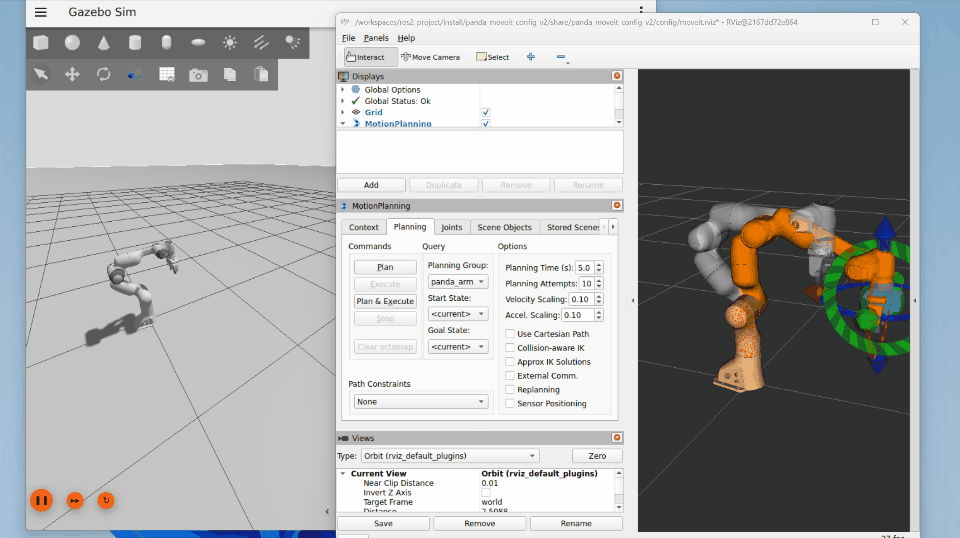

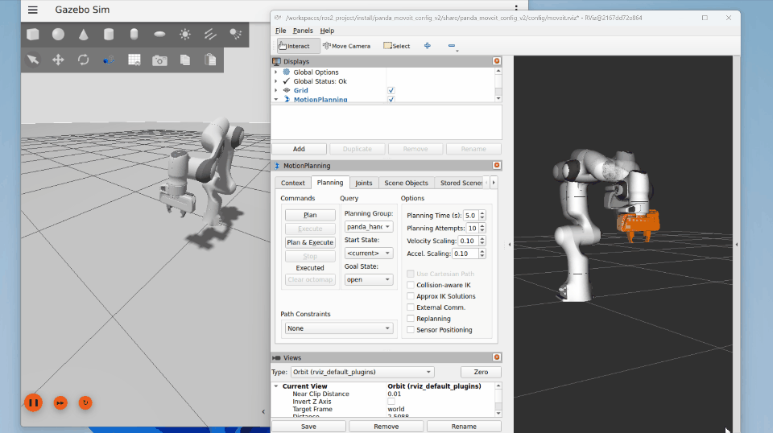


# 参考

- [https://github.com/ros-controls/gz_ros2_control/blob/rolling/doc/index.rst](https://github.com/ros-controls/gz_ros2_control/blob/rolling/doc/index.rst)
- [https://control.ros.org/jazzy/doc/gz_ros2_control/doc/index.html](https://control.ros.org/jazzy/doc/gz_ros2_control/doc/index.html)

