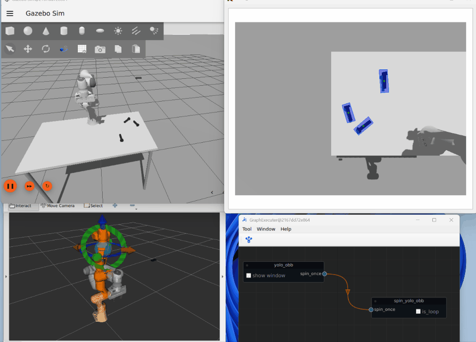

# moveit2_yolobb_ws



## 关于项目

YOLO机械臂仿真是一种结合了YOLO（You Only Look Once）目标检测算法与机械臂控制的智能化仿真系统。该系统通过YOLO实时检测环境中的目标物体，并结合机械臂的运动规划与仿真，实现自动化的抓取、分拣、装配等任务。该应用广泛应用于工业自动化、智能仓储、机器人教育等领域，为机械臂的智能化操作提供了高效、精准的解决方案。

在仿真环境中，YOLO算法能够快速识别目标物体的位置和类别，并将这些信息传递给机械臂控制系统。机械臂根据目标的位置和姿态，自动规划运动路径，完成抓取或操作任务。通过仿真平台（如Gazebo、CoppeliaSim或PyBullet），用户可以在虚拟环境中测试和优化机械臂的控制算法，降低实际部署中的风险和成本。

YOLO机械臂仿真的优势在于其高效的目标检测能力和实时性，能够适应动态环境中的多目标场景。同时，仿真平台提供了高度可控的实验环境，便于开发者调试算法、优化性能，并快速验证机械臂的工作效果。

**更新：**

- 2025-8-28：添加容器开发方式并优化代码。
- 2025-8-9：更新代码，使用GraphExeter显示控制。
- [2025-3-22：【代码】基于ros2与moveit2开发的yolo识别抓取虚拟机械臂](https://www.bilibili.com/video/BV1KqXWYHE6k/?vd_source=3bf4271e80f39cfee030114782480463)

## 克隆项目

```shell
git clone --recurse-submodules https://github.com/laoxue888/moveit2_yolobb_ws.git
```

## 环境配置

[配置开发环境](docs/userguide/1.installation/5.installation.md)


## 运行测试

[测试项目](docs/userguide/2.run_test/2.run_test.md)


## 参考

- [Pick and Place Simulation Using MoveIt and Yolov8 OBB](https://www.youtube.com/watch?v=ypr3RtJzgKI)
- [https://drive.google.com/drive/folders/1eDVATIX1mHBtSkI7ueQE2568mkxgno0f](https://drive.google.com/drive/folders/1eDVATIX1mHBtSkI7ueQE2568mkxgno0f)
- [https://gazebosim.org/docs/harmonic/getstarted/](https://gazebosim.org/docs/harmonic/getstarted/)