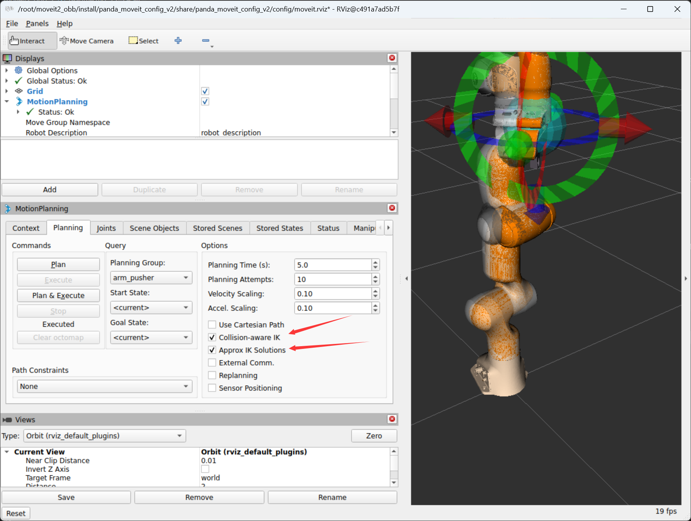
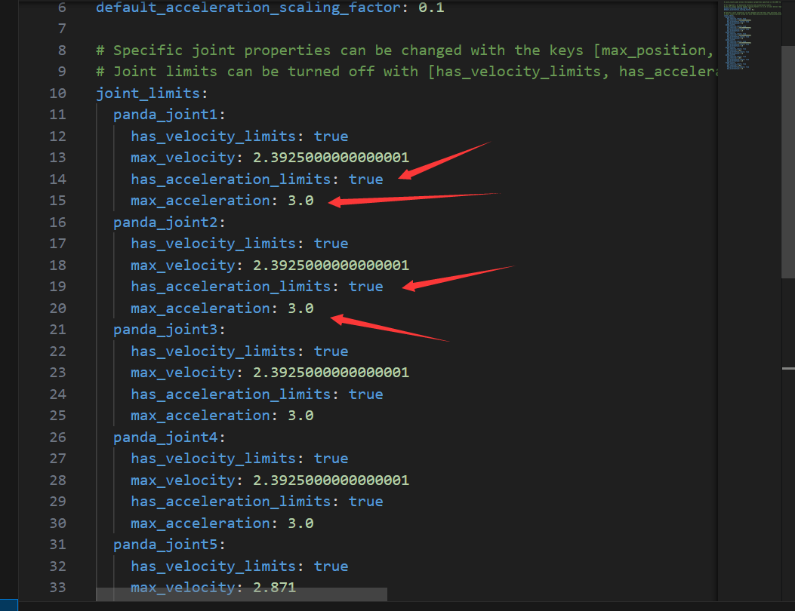
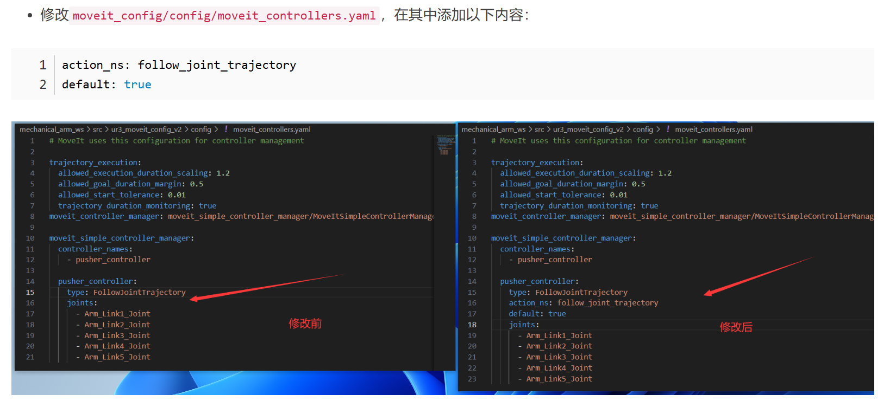

---

[TOC]

# 前言

配置和使用yolo机械臂仿真。

> 参考：
> - [Pick and Place Simulation Using MoveIt and Yolov8 OBB](https://www.youtube.com/watch?v=ypr3RtJzgKI)

# 环境配置

```shell
apt install python3-pip
pip config set global.index-url https://pypi.tuna.tsinghua.edu.cn/simple
pip install pyside6 xacro ultralytics --break-system-packages

# 安装gz
sudo apt-get update
sudo apt-get install curl lsb-release gnupg -y
sudo curl https://packages.osrfoundation.org/gazebo.gpg --output /usr/share/keyrings/pkgs-osrf-archive-keyring.gpg
echo "deb [arch=$(dpkg --print-architecture) signed-by=/usr/share/keyrings/pkgs-osrf-archive-keyring.gpg] http://packages.osrfoundation.org/gazebo/ubuntu-stable $(lsb_release -cs) main" | sudo tee /etc/apt/sources.list.d/gazebo-stable.list > /dev/null
sudo apt-get update -y
sudo apt-get install gz-harmonic -y

apt-get install x11-xserver-utils
apt install libxcb* -y

apt install ros-${ROS_DISTRO}-moveit* -y

sudo apt-get update 
sudo apt-get install -y ros-${ROS_DISTRO}-rmw-cyclonedds-cpp 


export RMW_IMPLEMENTATION=rmw_cyclonedds_cpp
export LIBGL_ALWAYS_SOFTWARE=1
export GZ_SIM_SYSTEM_PLUGIN_PATH=/opt/ros/${ROS_DISTRO}/lib/

# sudo apt install ros-${ROS_DISTRO}-gazebo-ros-pkgs ros-${ROS_DISTRO}-gazebo-ros2-control -y

sudo apt install ros-${ROS_DISTRO}-controller-manager -y
sudo apt install ros-${ROS_DISTRO}-joint-trajectory-controller -y
sudo apt install ros-${ROS_DISTRO}-joint-state-broadcaster -y
sudo apt install ros-${ROS_DISTRO}-diff-drive-controller -y

apt install ros-${ROS_DISTRO}-ros-gz

apt-get install ros-${ROS_DISTRO}-joint-state-publisher-gui

apt install ros-${ROS_DISTRO}-moveit-ros-planning-interface

# apt install ros-jazzy-gz-ros2-control 这个很重要 https://github.com/ros-controls/gz_ros2_control
apt install ros-${ROS_DISTRO}-gz-ros2-control

# 用于调试
apt-get install gdb

pip install NodeGraphQt --break-system-packages
```

# 基本操作

```shell
# 创建文件夹
ros2 pkg create pkg_demo --node-name helloworld_node --build-type ament_python --dependencies rclpy std_msgs
```

# 运行测试

```shell
# Shell A
source install/setup.bash
ros2 launch panda_moveit_config gazebo_obb.launch.py

# Shell B
source install/setup.bash
ros2 launch panda_moveit_config arm_control.launch.py

# Shell C
source install/setup.bash
ros2 launch yolov8_obb yolov8_obb.launch.py

# Shell D
source install/setup.bash
cd src/ui_controller/
python3 bolt_selector.py
```

# moveit




# 编译调试

```shell
colcon build --cmake-args -DCMAKE_BUILD_TYPE=Debug
```

# 报错

❌

```shell
[move_group-3] [ERROR] [1742286584.537923487] [move_group.moveit.moveit.core.time_optimal_trajectory_generation]: No acceleration limit was defined for joint panda_joint1! You have to define acceleration limits in the URDF or joint_limits.yaml
```

✔️

设置好加速度



❌

```shell
[move_group-3] [ERROR] [1742286725.635634628] [move_group.moveit.moveit.ros.trajectory_execution_manager]: Unable to identify any set of controllers that can actuate the specified joints: [ panda_joint1 panda_joint2 panda_joint3 panda_joint4 panda_joint5 panda_joint6 panda_joint7 ]
[move_group-3] [ERROR] [1742286725.635688171] [move_group.moveit.moveit.ros.trajectory_execution_manager]: Known controllers and their joints:
[move_group-3] 
[move_group-3] [ERROR] [1742286725.635703240] [move_group.moveit.moveit.ros.plan_execution]: Apparently trajectory initialization failed
[move_group-3] [INFO] [1742286725.635767383] [move_group.moveit.moveit.ros.move_group.move_action]: CONTROL_FAILED
[rviz2-4] [INFO] [1742286725.636182552] [moveit_2565687607.moveit.ros.move_group_interface]: Plan and Execute request aborted
[rviz2-4] [ERROR] [1742286725.637270976] [moveit_2565687607.moveit.ros.move_group_interface]: MoveGroupInterface::move() failed or timeout reached
```

✔️



```shell
action_ns: follow_joint_trajectory
default: true
```